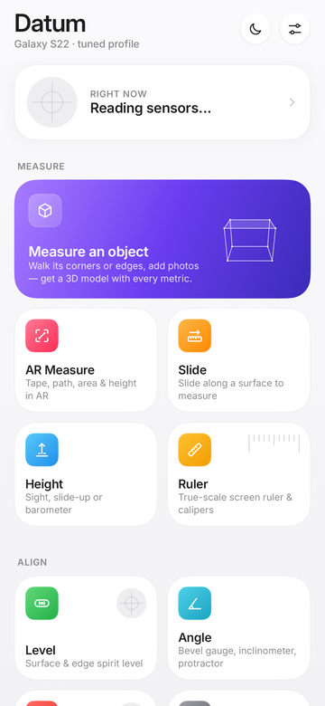
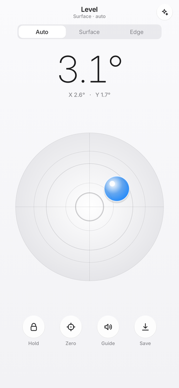
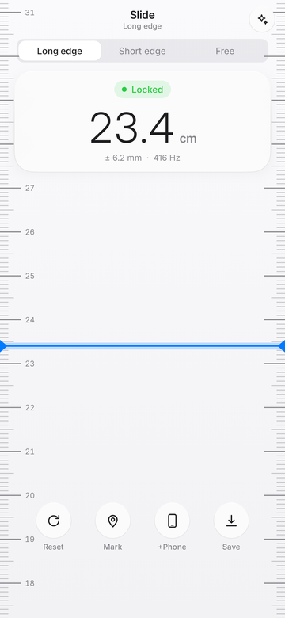
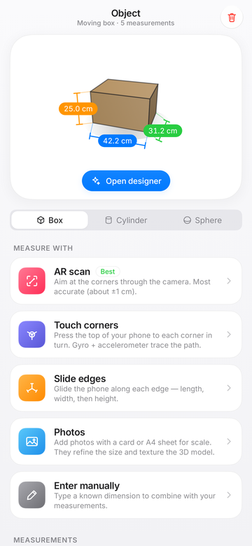
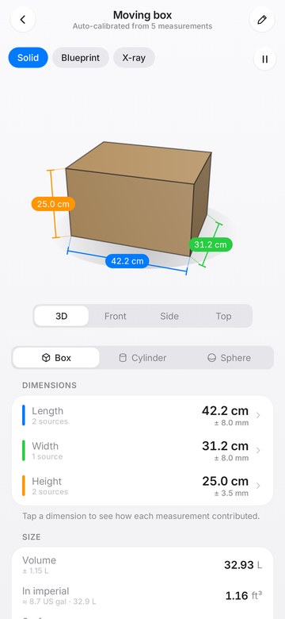
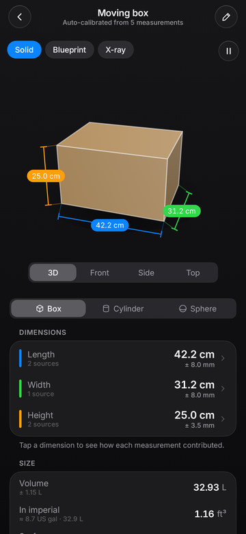
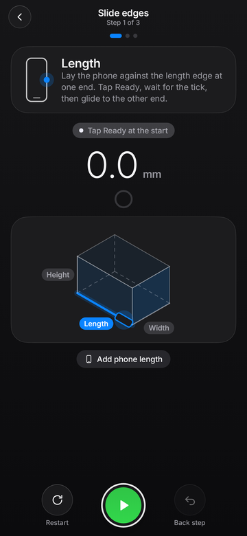
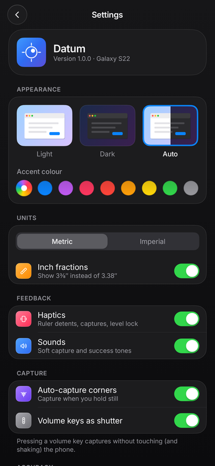

# Datum

**A measuring app for Android, tuned for Galaxy S22 and newer.** Datum uses the phone's motion sensors, camera,
barometer, magnetometer, light sensor and microphone to measure lengths, heights, angles, levels and whole 3D
objects. The interface is quiet and minimal, inspired by macOS.

<table>
  <tr>
    <td></td>
    <td></td>
    <td></td>
    <td></td>
  </tr>
  <tr>
    <td></td>
    <td></td>
    <td></td>
    <td></td>
  </tr>
</table>

## Install

1. Download [`dist/Datum-1.0.0.apk`](dist/Datum-1.0.0.apk) to the phone.
2. Open it and allow **Install unknown apps** for your browser or file manager when prompted.
3. Launch **Datum**. Permissions are asked only when a tool needs them.

The APK is minified, signed with the repository's non-secret sideload key (`keystore/`, password `android`), and
installs over earlier builds. It needs Android 8.0+ (API 26); every tool adapts to the sensors the phone actually has.

## Tools

### Measure
| Tool | What it does |
|---|---|
| **Object (3D)** | Measure a box, cylinder or sphere any way you like, then get an auto-built 3D model with every metric (details below). |
| **Slide** | Lay the phone on a surface and slide it: the distance appears on a true-scale tape that stays pinned to the table while the phone glides over it. You can drop **marking points**, add the phone's own length, pick the long edge, short edge or free 2D sliding (graph paper with your path), and feel ruler-like haptic detents (every cm or ¼″, stronger every 10 cm or inch). |
| **Height** | **Sight**: aim the camera at the base, then the top (two-angle clinometer with a pitch ladder). **Slide up**: glide the phone up a wall. **Barometer**: relative altitude between floors. |
| **AR Measure** | ARCore tape, path, area, height, box, cylinder and sphere, with a stabilised reticle and live labels. |
| **Ruler** | A true-scale on-screen ruler, calipers and circle gauge, using the panel's real pixel density (calibrate with any bank card). |

### Align
| Tool | What it does |
|---|---|
| **Level** | A surface bubble and an edge vial with liquid motion, an animated readout and a green lock at level. Readings are One-Euro filtered at 100 Hz, and two-point reversal calibration cancels sensor bias. Also has hold, zero, an audio guide, and slope in °, %, pitch (x/12) or ratio. |
| **Angle** | Bevel gauge (angle between two surfaces), inclinometer, and a camera protractor. |
| **Compass** | Magnetic or true north (local declination), lock a bearing, field-strength readout. |

### Sense
| Tool | What it does |
|---|---|
| **Stud finder** | Magnetometer-based detector for screws and nails behind drywall, with adjustable sensitivity. |
| **Light** | Lux, foot-candles and EV100, min/avg/max, with targets for reading, plants and photography. |
| **Sound** | Estimated A-weighted sound level (IEC 61672 weighting curve; phone mics aren't lab-calibrated), instant peak, Leq average, maximum, and a safe-exposure guide. |
| **Vibration** | Seismometer trace, live spectrum, dominant frequency and Modified Mercalli intensity. |
| **Sensors** | Every hardware sensor on the phone with live values, rates and power. |

Everything can be **saved to the Library** with its details.

## Measuring a 3D object

Pick **Box**, **Cylinder** or **Sphere** and combine any of these methods. Datum fuses them all:

- **AR scan**: tap the corners through the camera. This is usually the most accurate method.
- **Touch corners**: rest the phone's top edge, bottom edge or long side on each corner in turn. The gyroscope and
  accelerometer trace the path, and a best-fit box squares up the hand-placed corners.
- **Slide edges**: glide the phone along the length, width and height. An isometric guide shows which edge is next,
  animates the motion, and takes on the measured proportions as you go.
- **Photos**: add pictures of a face with a bank card or A4 sheet on it for exact scale. Without a reference, Datum
  recovers the face's true proportions from perspective. Corners snap to image features, and photos also texture the
  3D model.
- **Manual**: type any dimension you already know.

Each estimate carries its own uncertainty. The model combines them by inverse-variance weighting, uses photo
proportions to fill in missing dimensions, and shows how much each source contributed. The designer view gives you:

- an orbiting 3D model (solid, blueprint or x-ray; 3D, front, side or top) with dimension lines;
- volume, surface area, diagonal, imperial equivalents, dimensional (shipping) weight and estimated weight by material;
- whether it fits in common containers (cabin bag, moving boxes, pallet, shipping container) or through a doorway;
- exports to **OBJ**, **PNG**, or a printable **PDF blueprint** with orthographic views plus a box or cylinder net (actual size on A4 when it fits).

## Design

- macOS-style palette and accent colours, light, dark and auto themes with animated transitions.
- Inter variable typeface with tabular figures, continuous (squircle) corners, frosted-glass panels.
- A magnifying Dock with tooltips, running indicators and launch bounce. HUD confirmations, glass sheets.
- Haptics built from the vibrator's primitives (ticks, clicks, success), and soft synthesized tones.
- The volume keys act as a shutter, so captures don't shake the phone.

## Devices

Datum ships calibrated profiles for the Galaxy **S22, S23, S24, S25 and S26** families (including Plus, Ultra, FE
and Edge) and the **Z Fold4–7** and **Z Flip4–7**. A profile gives body size, panel size and density, so the ruler,
the phone-length offsets and the contact points are exact. Other Android phones get an estimated profile that you can
fine-tune in **Settings → Calibration**. Tools that need missing hardware (barometer, magnetometer, ARCore and so on)
hide or explain themselves.

## Privacy

Camera, microphone and coarse location (for true north only) are requested just in time. The app has **no
internet permission**: nothing leaves the phone unless you share an export yourself.

## Accuracy and tips

- **Motion measuring** (Slide, Height slide-up, Touch corners, Slide edges) integrates the accelerometer twice,
  so error grows with time. Hold still for the start tick, make one smooth movement, and pause at the end. Short,
  steady slides give the best results. Recalibrate on a flat table if readings drift.
- **AR** works best in good light on textured surfaces. Move the phone slowly at first so ARCore can map the scene.
  AR requires Google Play Services for AR, which Datum offers to install.
- **Photos** are most accurate shot straight-on, with the reference card flat on the same face and filling a good
  part of the frame.
- Cross-check anything critical with a second method; the Object designer does this automatically.

## Build from source

Requirements: JDK 17+ and the Android SDK (compile SDK 37).

```bash
./gradlew :app:assembleRelease          # → app/build/outputs/apk/release/app-release.apk
./gradlew :app:testDebugUnitTest        # algorithm tests + Robolectric UI tests
./gradlew :app:testDebugUnitTest -Proborazzi.test.record=true   # also renders screenshots to app/build/screenshots
```

The algorithm tests check the core maths against synthetic ground truth: inertial odometry on simulated IMU data,
homography and perspective recovery, corner snapping, box fitting, fusion, A-weighting and level calibration.

## Project layout

```
app/src/main/java/com/akhielesh/datum/
├── core/
│   ├── math/        vectors, quaternions, filters (One Euro, FFT)
│   ├── sensors/     MotionTracker (strapdown odometry + ZUPT), level, acoustics, vibration, SensorHub
│   ├── geometry/    homography, perspective aspect, corner snapping, box fitting, fusion, shape metrics
│   ├── device/      Galaxy device catalogue and generic estimates
│   ├── data/        settings, library, object drafts (DataStore + JSON)
│   └── units/, feedback/
├── ar/              ARCore engine (GL background, hit testing, shapes)
└── ui/              design system (theme, glass, icons, components), navigation, and one package per tool
```

## Ideas for what's next

- **Room scan**: walk the walls in AR to get a floor plan with area, perimeter and paint or flooring estimates.
- **Volume from photos**: a full 3D reconstruction from a short orbit video (structure-from-motion).
- **Live AR overlay of the designed model** so you can preview whether a box fits on a shelf before moving it.
- **Wear OS companion**: level and angle readouts on the watch while the phone sits on the work.
- **Galaxy UWB distance**: distance between two UWB-equipped Galaxy phones (Plus and Ultra models) without line of sight.
- **Tremor and gait analysis** with the vibration engine, or a **bike or car level** mode with a dashboard mount.
- **Batch measurements and CSV export**, plus labels and photos on Library items.
- **Projects**: group measurements, objects and photos for a room or a move, and share them as a single PDF.

## Credits

[Inter](https://github.com/rsms/inter) typeface © The Inter Project Authors, under the SIL Open Font License 1.1
([`third_party/inter/OFL.txt`](third_party/inter/OFL.txt)). Built with Jetpack Compose, CameraX, ARCore and
[Haze](https://github.com/chrisbanes/haze) (Apache 2.0).
